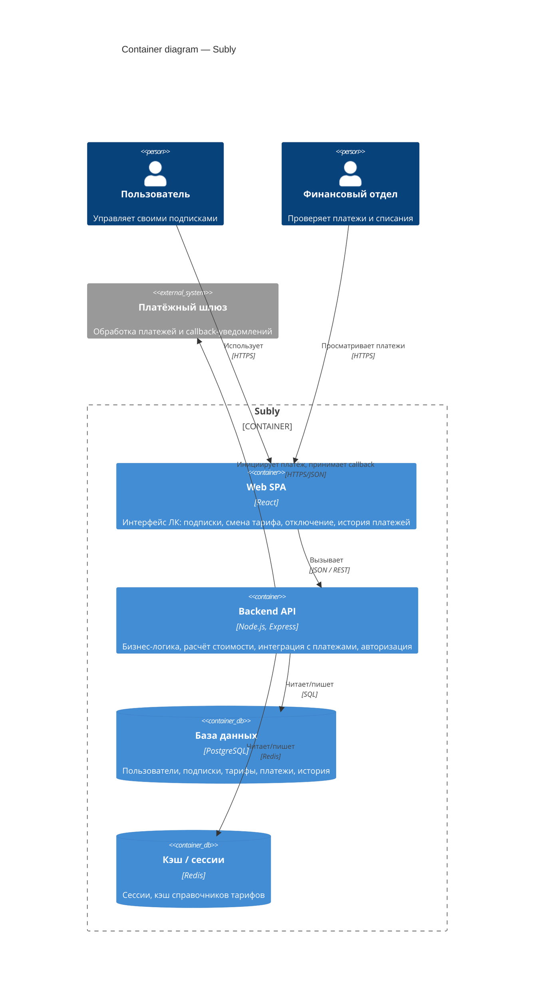

# C4  — Containers

```mermaid
C4Container
    title Container diagram — Subly

    Person(user, "Пользователь", "Управляет своими подписками")
    Person(finance, "Финансовый отдел", "Проверяет платежи и списания")

    System_Ext(paymentGateway, "Платёжный шлюз", "Обработка платежей и callback-уведомлений")

    Container_Boundary(subly, "Subly") {
        Container(spa, "Web SPA", "React", "Интерфейс ЛК: подписки, смена тарифа, отключение, история платежей")
        Container(api, "Backend API", "Node.js, Express", "Бизнес-логика, расчёт стоимости, интеграция с платежами, авторизация")
        ContainerDb(db, "База данных", "PostgreSQL", "Пользователи, подписки, тарифы, платежи, история")
        ContainerDb(cache, "Кэш / сессии", "Redis", "Сессии, кэш справочников тарифов")
    }

    Rel(user, spa, "Использует", "HTTPS")
    Rel(finance, spa, "Просматривает платежи", "HTTPS")
    Rel(spa, api, "Вызывает", "JSON / REST")
    Rel(api, db, "Читает/пишет", "SQL")
    Rel(api, cache, "Читает/пишет", "Redis")
    Rel(api, paymentGateway, "Инициирует платёж, принимает callback", "HTTPS/JSON")

    UpdateLayoutConfig($c4ShapeInRow="2", $c4BoundaryInRow="1")
```
